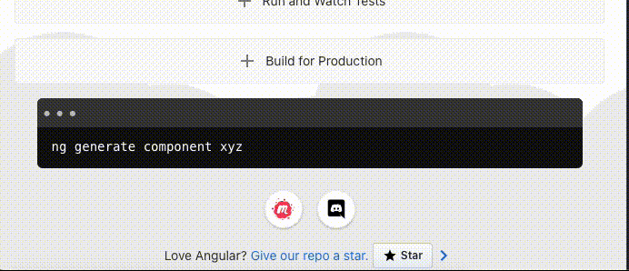

# Refresher JS - New Version Notifier

**Detects on client side that a new version of the application is available
and notify the active users to refresh their page in order to get the fresh version**

  - **The problem**: 
     We noticed in my team that some of the features and bug fixes that we are deploying can take to some users few days or more to get.  
<<<<<<< HEAD
     The reason is that some users are not closing the browser when they are done working so the new updates wouldn't take place until they refresh their page
=======
     The reason is that some users are not closing the browser when they are done working so the new updates wouldnt take place until they refresh their page  
>>>>>>> da4365975b2e71dbf24a3628af66d1c4edc65de4
     and fetch the new version of the webapp.


  - **The solution**: 
    A client side script that once in a while detects that a new version is live and notifies the user about it.


### Features:
  - Installation is extremely quick and simple
  - Out of the box support for modern frameworks 
  - User activity detection in order to minimize redundant calls to the server
  - Customization options for the notification



### Technology stack: 
  - The script itself is Vanilla JS and it supports the frameworks: Angular, React and Vue.  

  -----------

## Installation

 - Add this script tag to your web application's `index.html` file

```html
    <script
      id="refresher-js-script"
      type="text/javascript"
      src="https://cdn.jsdelivr.net/gh/Nemo9439/refresher-js@main/dist/refresher.v1-0.min.js"
      defer
    ></script>
```

----

## Configuration Options
  The script behavior can be configured by adding the following params to the script tag.
  *All of them are optional*

  - **data-polling-interval-in-minutes** (Number) (Default = '120'):
      The number of minutes that the script will trigger a call to the server to check if a new version is available.

  - **data-title-text** (String) (Default = 'New version is available'):
      The text of the main title on the top of the notification.

  - **data-subtitle-text** (String) (Default = 'Please refresh the page'):
      The smaller text of the notification.

  - **data-primary-color** (String) (Default = '#004dff'):
      The color of the side line and the refresh button.

  - **data-refresh-button-text** (String) (Default = 'refresh'):
      The text on the refresh button.

  ## Advanced Configuration
  **The next configuration options are for unusual cases,
  applications that have non-standard behavior or need higher degree of customizations.**

  - **data-disable-toast** (Boolean) (Default = 'false'):
      When set to true the notification would not appear.  
      This should be used only in applications that need custom behavior when a new version is detected.
      
      > Whenever a new version is detected a custom event (`refresher-js-open-toast`) will be triggered (regardless of the value of data-disable-toast)

      *Example Usage*
      ``` ts
          document.addEventListener('refresher-js-open-toast', function () {
          console.log('refresher-js-open-toast custom event was triggered');
        });
      ``` 

  - **data-custom-function-name** (String - Function Name): 
      When there is a need for a custom check of a new version,  
      during the polling the script will look for the given function name in the `window` scope  
      and run it instead of the default check.  
      
      > The custom function has to be on the `window` and has to return `Promise<boolean>`

      *Example  Usage*
      [angular-demo-with-custom-function-name](/demo/angular-demo-with-custom-callback/src/index.html)

-----

## Development
1. [INSTALL](INSTALL.md)

